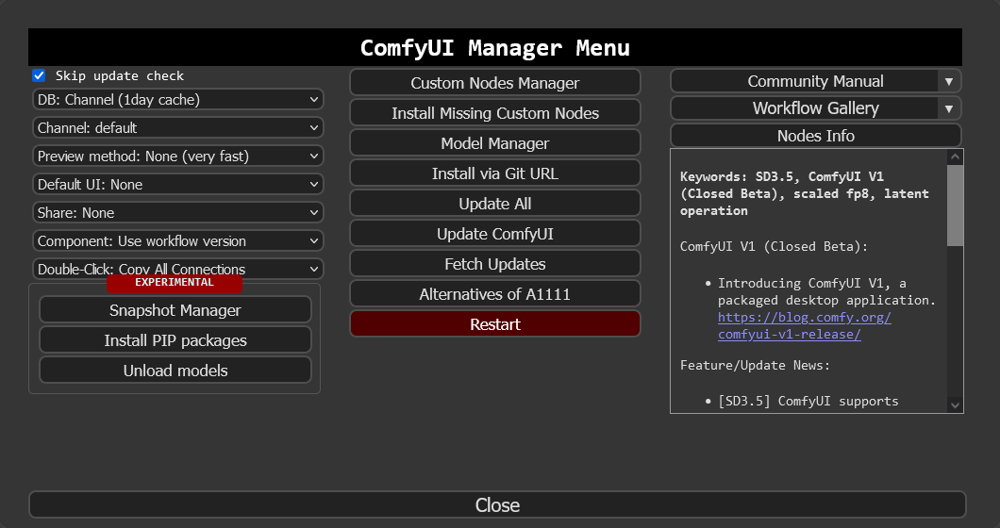
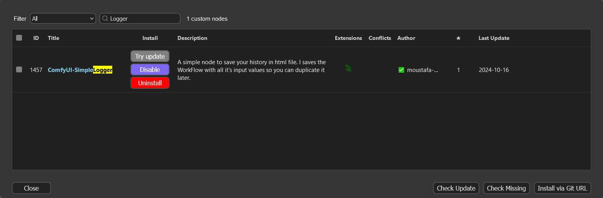
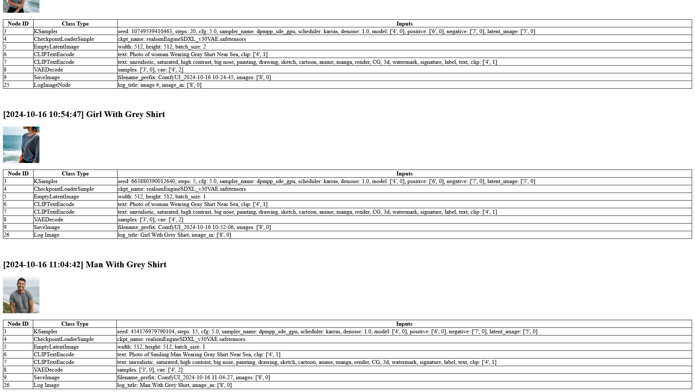

# ComfyUI-SimpleLogger

A simple node to save your history in html file. I saves the WorkFlow with all it's input values so you can duplicate it later.

-----------

## Installation

### Installation[method1] (General installation method)

1. download the 
2. extract to `ComfyUI/custom_nodes` folder
3. rename folder to `ComfyUI-SimpleLogger`
4. restart ComfyUI

### Installation[method2] (Using ComfyUI-Manager only)

Using [ComfyUI-Manager](https://github.com/ltdrdata/ComfyUI-Manager) goto "Manager > Custom Node Manager"

Search for `Logger` and select the one by `moustafa-nasr`

## Usage Example

Consider the following workflow of vision an image, and perform additional text processing with desired LLM. In the OllamaGenerate node set the prompt as input.

All the logs will be saved by date in folder
> { your_ComfyUI_folder }/Logs

Workflow Data will be saved in a HTML format

